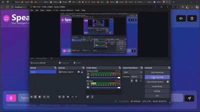

# 🎙️ SpeakEasy AI

**SpeakEasy AI** is a smart and elegant voice + text chat assistant built using **React**. Talk to the AI using your voice or keyboard, and hear it respond back using realistic speech. Ideal for hands-free interaction, accessibility, and a futuristic chatting experience.

## 🎞️ Demo Preview

 


---

## 🚀 Features

- 🎤 **Voice Recording**: Record voice input using the microphone
- 🧠 **AI Chat**: Send questions or prompts and get intelligent responses
- 🔊 **Text-to-Speech**: AI responses are spoken aloud automatically
- ✏️ **Transcription Editing**: Edit your recorded message before sending
- 🔇 **Mute Option**: Mute audio playback any time
- 🗑️ **Clear Chat**: Delete entire conversations with one click
- 🎨 **Modern UI**: Smooth, responsive interface built with TailwindCSS

---

## 🛠️ Tech Stack

- **Frontend**: React, TailwindCSS
- **Icons**: Lucide React
- **APIs**: Web Audio API, MediaRecorder
- **Backend API Endpoints**:
  - `/transcribe`: Speech-to-Text
  - `/chat`: Chat response from LLM
  - `/text-to-speech`: Convert AI text to speech

> ⚠️ This app requires a backend service that supports voice transcription, chat, and text-to-speech.  
> The backend code is here : https://github.com/shivanksi42/speakeasy-backend
> 

---

## 📦 Installation

```bash
git clone https://github.com/yourusername/speakeasy-ai.git
cd speakeasy-ai
npm install
npm run dev
```

📁 Project Structure
bash
Copy
Edit
/src
  ├── VoiceChatApp.jsx   # Main component logic and UI
  ├── App.css            # Tailwind styling
  └── index.js           # App entry point

✅ Usage
Click the mic to record a voice message

Review/edit the transcription before sending

Use the text box to chat normally

Click play to hear audio responses

Toggle mute, or clear chat anytime


💡 Roadmap / Future Ideas
🌍 Support for multilingual input/output

🔊 Voice customization (male/female, accent)

💾 Conversation history and saving

📱 Full mobile responsiveness and PWA support

🧠 Choice of AI engines (OpenAI, Google, etc.)


🙏 Acknowledgements
Icons: Lucide
Design inspired by conversational AI platforms

💬 Feedback
Found a bug? Have suggestions?
Open an issue or reach out via GitHub Issues

📄 License
MIT © 2025 Shivam Kumar
